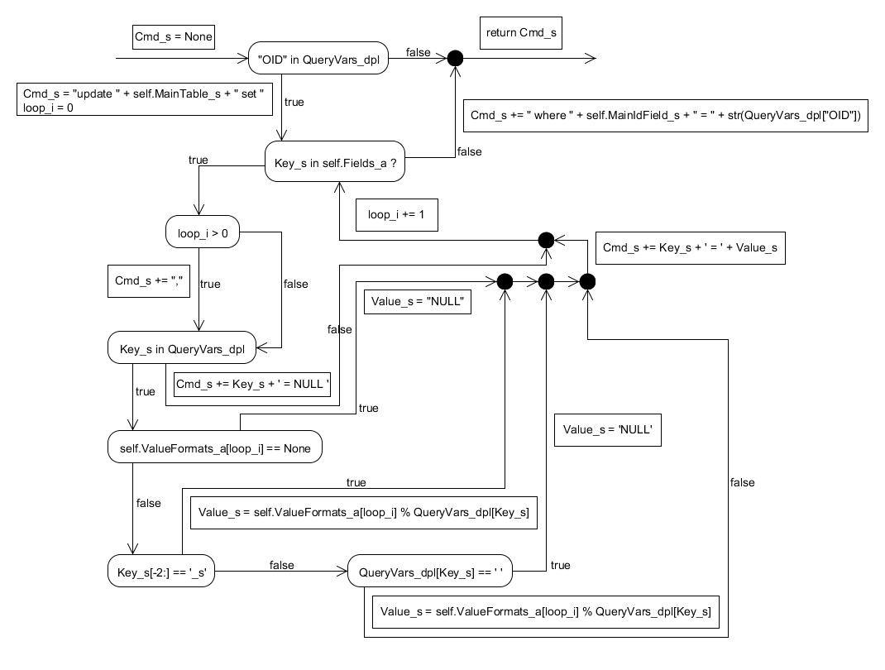

---
author:
	name1: Cristea, Liviu, 879401
	name2: Hensel, Simon, 880997
	name3: Wewering, Lukas, 880680
title:
	main: Testdokumentation
	sub1: SWE-Praktikum
	sub2: WS 2014/2015
revision:
	doc: swe_p3_testdoc.0.md
	level: 0
	date: 07.01.2015
lang: de
---

# Testdokumentation für aqwsqm.py

## Kontrollflussgraph für die Methode Generate_px(self, QueryVars_dpl) der Klasse UpdateStatement_cl 

## Testfälle und Dokumentation

====================
Testcase: OID nicht gesetzt
====================
Output:
2

====================
Testcase: OID ist gesetzt
====================
Output:
1
3
5
6
9
10
3
4
7
3
4
7
3
4
7
3
4
7
3
4
7
3
4
6
9
10
3
4
7

====================
Testcase: for-Schleife wird nicht betreten
====================
Output:
1
14

====================
Testcase: Formatierungsparameter ist none
====================
Output:
1
3
5
6
8
3
4
7
3
4
7
3
4
7
3
4
7
3
4
7
3
4
6
9
10
3
4
7

====================
Testcase: Datentyp ist nicht String
====================
Output:
1
3
5
6
9
11
13
3
4
7
3
4
7
3
4
7
3
4
7
3
4
7
3
4
6
9
10
3
4
7

====================
Testcase: Uebergebener Wert ist leer
====================
Output:
1
3
5
6
9
11
12
3
4
7
3
4
7
3
4
7
3
4
7
3
4
7
3
4
6
9
10
3
4
7
